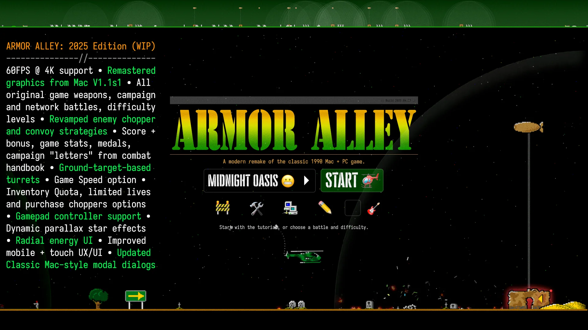
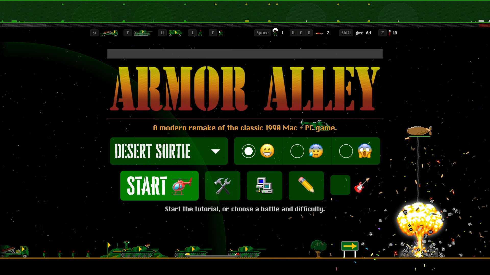

## **Armor Alley: Remastered**

```
 ╭────────────────────────────────────────────────────────────────────╮
 │                                                                    │
 │                                       ▄██▀                         │
 │                                     ▄█▀                            │
 │                     ▄████▄▄▄▄▄▄▄▄▄ █▀▄▄▄▄▄▄▄▄▄▄▄                   │
 │                                 ▄█████▄▄▄▄  ▀▀▀                    │
 │                            ▄████████████████▄                      │
 │                █▄         ▀████████████████████▄                   │
 │                ▀█▄       ▄██████████████████████                   │
 │                 ███▄▄▄████████████████████████▀                    │
 │                ▀█████████▀▀▀▀▀▀▀▀███▀▀█▀▀▀▀█▀                      │
 │                 █▀                ██▘▘ ██▘▘                        │
 │                                                                    │
 │                                                                    │
 │      ████▙   ▀████▌████▙  ▀█████   █████▀ ▄██████▄ ▀████▌████▙     │
 │     ▕█████▏   ████▌ ████▌  ▐████▌  ████▌ ████▎▐███▊ ████▌ ████▌    │
 │     ▐▐████▎   ████▌ ████▌   █████ ▌████▌▐███▊  ████▏████▌ ████▌    │
 │     █▌████▋   ████▌▗████▘   ▌█████▌████▌████▊  ████▌████▌▗████▘    │
 │    ▐█▌▐████   ████▌████▘    ▌█████▌████▌████▊  ████▌████▌████▘     │
 │    ██ ▄████▎  ████▌▝███▙    █▐████ ████▌████▊  ████▌████▌▝███▙     │
 │   ▐█▌██████▌  ████▌ ████▌  ▕█ ███▌ ████▌▐███▊  ████ ████▌ ████▌    │
 │   ███  ▐████  ████▌ ████▌▗▋▐█ ▐██  ████▌ ████▎▐███▊ ████▌ ████▌▗▋  │
 │  ▄███▄ ▄████▌▄█████▄▀████▀▄██▄ █▌ ▄█████▄ ▀██████▀ ▄█████▄▀████▀   │
 │                                                                    │
 │       ████▙   ▀█████▀    ▀█████▀     ▀████▐███▋▀██████▀ ▀████▀ TM  │
 │       █████▏   █████      █████       ████  ▝█▋ ▝████▙   ▝██▘      │
 │      ▐▐████▎   █████      █████       ████   ▝▋  ▝████▙  ▗█▘       │
 │      █▌████▋   █████      █████       ████ ▗█     ▝████▙▝█▘        │
 │     ▐█▌▐████   █████      █████       ████▐██      ▝█████          │
 │     ██ ▄████▎  █████      █████       ████ ▝█       █████          │
 │    ▐█▌██████▌  █████    ▗▋█████    ▗▋ ████   ▗▋     █████          │
 │    ███  ▐████  █████  ▗██▌█████  ▗██▌ ████  ▗█▌     █████          │
 │   ▄███▄ ▄████▌▄█████▐████▌█████▌████▌▄████▐███▌   ▄███████▄        │
 │                                                                    │
 │                     [  R E M A S T E R E D  ]                      │
 │                                                                    │
 ╰────────────────────────────────────────────────────────────────────╯
```

A browser-based interpretation of the Macintosh + MS-DOS releases of Armor Alley.

Copyright (c) 2013, Scott Schiller

https://armor-alley.net/

Code provided under the [Attribution-NonCommercial 3.0 Unported (CC BY-NC 3.0) License](https://creativecommons.org/licenses/by-nc/3.0/)

Original game Copyright (C) 1989 - 1991, Information Access Technologies.

https://en.wikipedia.org/wiki/Armor_alley

## **Quick Links**

- 2025 Version 3.00 (work in progress) Overview (33m 45s): https://youtu.be/E8eJ8v7pQNw

- 10th Anniversary summary video (3m 45s): https://youtu.be/oYUCUvg02rY

* History, review, tutorial, demos, "Midnight Oasis" walk-through: (1h 12m 55s): https://youtu.be/6wEMcssFJ-E

- [Original article about building "V1.0"](https://schillmania.com/content/entries/2013/armor-alley-web-prototype/) (from 2013)

- 2022 Demo, features and walk-through of "extreme" mode (55 minutes): https://youtu.be/9BQ62c7u2JM

## **Developer Notes**

For running the game locally and JS + CSS build instructions, see [src/README.md](src/README.md).

## **Changelog / Revision History**

## **V3.00.2026xxxx: 2026 Work In Progress**

60 fps, improved performance, revamped game logic and enemy "AI", improved mobile + touch screen support, tons of new details and effects.



Version 3.00 Overview (33m 45s): https://youtu.be/E8eJ8v7pQNw

## **V2.01.20230520: 10th Anniversary "Remastered" Edition Addendum**

Previous release: V2.0.20230501.



## Video overview

- 10th Anniversary summary video (3m 45s): https://youtu.be/oYUCUvg02rY

- History, review, tutorial, demos, "Midnight Oasis" walk-through: (1h 12m 55s): https://youtu.be/6wEMcssFJ-E

## Bug fixes of note

- Don't let helicopter reach absolute edge of screen; buffer 5% on each side.

- Mobile / touchscreen: Bananas weren't firing sometimes, due to incorrect keyboard mappings.

- Sound: Always wait for sound load before firing `onplay()`.

- Sound: Relative, in terms of distance to the helicopter.

- Video: Ensure video is active when initial request / preload completes before playing.

- Editor: Engineers were being output as infantry.

- Update positioning of helicopter trailers for both sides, and when rotated.

- BnB: Show existing "Cornholio" turrets at start of game.

- "Midnight Oasis" network level: Added terrain decor - gravestones, trees etc.

## Updates

- Project now has its own site: https://armor-alley.net/

- Nice progressive web app-style icon set.

- Updated "Armor Alley" wordmark to resemble the original boxed software one, based on the "Stencil Compress D" font.

## For developers

- Added developer notes, `gulp-cli`-based build via `npm`: [src/README.md](src/README.md).

- Concatenated + minified / bundled JS + CSS files, see [gulpfile.js](gulpfile.js) for build script.

- SM2 + Snowstorm are now ES6 modules, included vs. concatenated into bundle.

---

## **V2.0.20230501: 10th Anniversary "Remastered" Edition**

Previous release: V1.6.20220201. Original release: V1.0.20131031.

## New features

- **Mobile / touch screen support**. Updated UX / UI, better playability and feature parity vs. desktop. Portrait is playable, but landscape is preferable on smaller screens.

- **Network multiplayer**, like the original game. PvP, or co-op. Can be played with or against CPU players, as well.

- **22 game levels.** 10 original game "campaign" battles, plus 12 levels designed for network games.

- **Level editor**. Create or modify existing levels. Data stored in URL at present - terrible, I know. Also compatible with network games.

- Optional **"Virtual Stupidity"** theme pack. 🎸🤘

## Performance improvements

• Reduced CPU load, in general, across the board between JavaScript execution, layout, and paint / compositing.

• Game Loop: Adjustments to target 30FPS on 120 Hz monitors. [01f9f43](https://github.com/scottschiller/ArmorAlley/commit/01f9f435424c6b61f8765b13dd52504cd9b3d397)

• Collision "zones", greatly reducing object comparison work and function calls. 20,000 collision checks per second, down to 500 or less. https://twitter.com/schill/status/1627725917345955840

• DOM node pool / recycling: `poolBoy.js` - for things like gunfire and smoke. Less paint / repaint, more GPU compositing. https://twitter.com/schill/status/1628833430988554240

• Reduced variable / object creation in game loop.

• Battlefield DOM node no longer being transformed for scroll; now, only on-screen sprites.

## Sound

• Even more sound effects.

• Some sounds can use ±5% playback speed for a little variety.

• Sounds can now be heard "in the distance," to the left and right.

• "Virtual Stupidity": 500+ meticulously-picked samples. [21f7726](https://github.com/scottschiller/ArmorAlley/commit/21f7726acde0b03b251e589963e1dde556566a74)

## UX / UI

• "Live Graveyard" feature: decorate the battlefield over time. [032f845](https://github.com/scottschiller/ArmorAlley/commit/032f8459321ea61a73421450be44d7c4340a9e66)

• "Remastered" 8-bit sprite assets from Armor Alley V1.1 for Macintosh. The original 1.0 and PC-DOS version had up to 4-bit colour.

• Nice home page logo, "scanned" from the combat handbook that came with the original boxed game.

• Network games use Windows 95's `LIGHTS.EXE` taskbar UI showing tx/rx traffic, very important. ;) https://twitter.com/schill/status/1636449071140605958 [17c0a9b](https://github.com/scottschiller/ArmorAlley/commit/17c0a9b4a2deb1770281b84842ee1c4f56412bf6)

• Four types of stormy weather: rain, hail, snow, and one other that's a surprise.

• Radar jamming: New visual noise overlay.

• "Extra-fancy" bunker explosions, particles, burning, and smoke effects.

• Nicer bomb explosion on ground. Hat tip: "Dirt Explosion" by SrGrafo on DeviantArt - https://www.deviantart.com/srgrafo/art/Dirt-Explosion-774442026

• "DOMFetti" confetti explosions, colours based on the target being hit.

• Notifications: Verbiage for different actions, e.g., "your tank steamrolled an infantry", or gunfire "popped a balloon" etc.

## Bug fixes

• Refactor of Traffic Control, so vehicles are less likely to get "stuck" waiting for one another.

• Helicopter bombs could be delayed after key press. They should now be consistent and fire on the next frame.

• Super Bunkers would sometimes stay yellow, even when friendly.

• Additional "arrow signs" on battlefield were missing from bases since 2013. Oops. ;)

• Paratroopers (dropped from helicopter) no longer get a recycle (reaching end of battlefield) reward.

• Balloon respawning at top of screen: fixed.

• Allow balloons to be moving up or down at init, previously always downward.

• Fixed bomb spark / hidden / bottom-align logic.

• Tighten up inventory ordering / queueing, consistent spacing + avoiding overlapping between sprites.

## Gameplay

**Helicopters**

• Only the local player's helicopter blinks on the radar; all others are solid, as in the original game.

• Desktop: double-click no longer toggles helicopter auto-rotate feature.

**Smart Missiles**

• Notify user when trying to fire a smart missile, but no eligible targets nearby.

• Smart missiles can now take damage, and plow through up to four infantry (ground units only) before dying.

• Smart Missile targeting refactor. Removed former "missile facing target" requirement. Prefer shortest distance, unless just above ground. Hat tip: Pythagoras. :wink: :triangular_ruler:

• Smart Missiles now target your vertical offset, plus half your height.

• Smart Missiles now blink on launch, and take a moment (0.5 seconds) to arm themselves, and are not as dangerous (1 damage point) until then. This is implemented as the "Ramius frame count" (delay) [1d71faf](https://github.com/scottschiller/ArmorAlley/commit/1d71faf5dd66b38dad93e17aba9242a9b228a220) - as inspired by "The Hunt For Red October." https://www.youtube.com/watch?v=CgTc3cYaLdo&t=112s

• New feature: Smart Missile "decoy" ability, - about 1/3 of a second to see and retarget a newly-deployed paratrooper when the initial target was the helicopter. [926b16f](https://github.com/scottschiller/ArmorAlley/commit/926b16f262a9a45a91e75a5dfebbdb73bb457b49)

**Gunfire**

• Gunfire can now collide with gunfire.

• Turret gun firing rates have been reduced significantly for easy + hard levels.

• Gunfire can now ricochet off the roof of a Super Bunker.

• Desktop: Helicopter gunfire now stops when landing on, and cannot start while on a landing pad.

**Bombs**

• Bombs now "pass-thru" infantry, as opposed to dying 1:1.

• Bomb explosions on the ground can now take out larger groups of infantry.

• Bombs can be hit by gunfire in extreme mode.

**Tanks**

• Tanks have finally been given flamethrowsers (as in the original game,) which they use on infantry, engineers, super bunkers and end bunkers. [e3de57e](https://github.com/scottschiller/ArmorAlley/commit/e3de57e8c1aa009c09c0c67f424515a5f1e178e8)

• Game preferences refactor. Volume control, UX/UI, and optional gameplay features.

• Enemy tanks fire every 11 frames in "hard" mode, 12 in "easy" (and tutorial), and 10 in "extreme." Previously, all were 10.

• Tanks now repair more incrementally, larger gains every 1 second.

**Other**

• Engineers start repairing bunkers (if enabled) at the doorway, "shielded" by bunker vs. previously standing outside.

• Landing pads can be "The Danger Zone" if enabled in prefs. This was inspired by the 2022 Top Gun movie release. See also: "The Girl From Ipanema, "I Got You Babe," "Mucha Muchacha," and more.

• Base explosions can now also damage units passing by.

• Bases can fire rubber chickens + bananas if "match missile type" enabled in prefs.

• "GOURANGA!" - inspired by the original Grand Theft Auto.

• When the battle is over, the losing team's units all contribute to the explosion party.

## Technical

• Codebase migration to ES6 modules, patterns and syntax.

• SoundManager 2: hacked-together version of Web Audio API for playback, vs. HTML5. [a44bc81](https://github.com/scottschiller/ArmorAlley/commit/a44bc81b53dc5fd2b7f8219abec6278af05b746c)

• Refactoring of game type and objects system; e.g., `tank` -> `TYPES.tank`, and `game.objects.tanks[]` -> `game.objects.tank[]` so look-ups and interating by type are logical.

• `game.players` now has local, remote, cpu etc., which point to helicopters. Previously, many assumptions were made about `game.objects.helicopters[0]` and `[1]`.

• Network feature uses [PeerJS](https://peerjs.com/) (MIT license) for peer-to-peer communication via WebRTC.

## Miscellaneous

• It turns out there are _three_ types of cloud sprites in the original game, not two. [4a561c4](https://github.com/scottschiller/ArmorAlley/commit/4a561c4fac6efb7f85b8831710b228bd1a750eaa)

• 12 smoke frames in the original game too, vs. my 9. [53f08aa](https://github.com/scottschiller/ArmorAlley/commit/53f08aab45b76d4c4975e3d8c7c02d433eba7aeb)

• Nicer ASCII block-character logo.

• Updated favicon + related app / tile images.

---

**V1.6.20220101: Massive update for 2022, based on work from 2020 + 2021**


**Video overview**

- Demo, features and walk-through of "extreme" mode (55 minutes): https://youtu.be/9BQ62c7u2JM

**Performance improvements**

• The game should be smoother, targeting 30FPS. It is OK full-screen @ 1080p and windowed @ 4K in Chrome on a 2018 Mac Mini, 3.2 GHz 6-core i7 w/Intel UHD Graphics 630 1536 MB.

• More GPU-accelerated rendering, reduced DOM nodes by removing when off-screen (e.g., static terrain items)

• All sprites should be on the GPU and moved using transforms, reducing paint operations

• All transforms (CSS + JS) for positioning + animation are 3d, with the goal of GPU acceleration - e.g., translate3d(), rotate3d(), scale3d()

• DOM nodes are not appended at object create time - now deferred until the object is on-screen for the first time.

• All "sub-sprites" should now be GPU-accelerated via CSS animations, transforms and transitions

• Sound: Only create `Audio()` when actively playing sounds, and destroy when they finish playing. Browsers are starting to limit the number of `Audio()` instances.

• Sound: Queue and play sounds all at once with each animation frame callback, vs. prior ad-hoc behaviour.

• Refactored game tip scroller to only show two nodes at a time, 1024px width vs. 102,400px. Front-end tech / Chrome Dev Tools demo: https://youtu.be/eVW0WgTdK3A

• Performance: Don't update known static radar items: turret, base, bunkers (bunker, end bunker, super bunker) unless marked as "stale" during resize / world scaling

• Performance: CSS / `contentVisibility` to reduce / optimize rendering costs

• Animation loop: improved timing, target 30 fps. Request next frame right away. Exit early if next frame arrives too quickly.

• Turret "scan" is now a CSS animation; previously, animated via JS.

• Smart missiles and helicopter trailers are now GPU-accelerated.

• Performance: Battlefield and radar units are now positioned via transform: translate3d() - no more legacy CSS shenanigans using `bottom: 0px`.

• Memory leak fixes: DOM nodes, audio events, and a few others.

**Sound**

• Over 100 sound assets now in use

• New and updated sound effects: Infantry and engineer gunfire, injury and death, credit +/-, helicopter and turret guns, shell casings on turrets,
bullets hitting the ground, turret being disabled and enabled (restored.)

**UX / UI**

• Proper "game options" modal with radio buttons and checkboxes for various UX/UI and gameplay features

• "It was a dark and stormy night" - option for snow on the battlefield. (May be slow on some computers.)

• Bunkers, balloons and super-bunkers now use graphics from the Macintosh (68K) version of Armor Alley; a bit more orange, and less garish yellow.

• Dune ][-style credit / debit UI and sounds

• Toast-style game notifications

• Health status bars when units are being hit or repaired

• New and improved smoke / particle effects, more explosions and shrapnel, more fun!

• Order queue: Refactored UI to show letters (e.g., MTVIE), with superscript numbers as appropriate.

• Missiles smoke more, and in extreme mode, have a burst of thrust (as in the original game) as they near expiry

• Pseudo-3D effect on shrapnel: Increase size slightly with vertical position on screen

• Ground units are "behind" most terrain elements like trees, bushes etc.

**Bug fixes**

• Bombing floating balloons no longer causes an explosion on the ground

• Improved bomb and shrapnel alignment / collision positioning with balloons, tanks, bunkers, and super-bunkers

• Fixed bug with quickly-respawning balloons (shooting balloon while infantry are passing under bunker, for example.)

• Fixed UI bug where the "incoming missile" white line would not always disappear.

• Game end: Improve alignment of view and base

• Adjusted initial position of game, centering view on the helicopter + base

• Helicopter / super-bunker: Improve vertical alignment if helicopter crashes on superbunker "roof."

• Fixed radar item for Super Bunkers, now shows correct friendly / enemy status.

• Cloud "wind" accelerates / decelerates more smoothly

• Clouds no longer "bounce" when they drift off the end of the world, but get a nice bit of wind to bring them back into view.

• Slight vertical alignment tweaks on gunfire and balloons in radar view.

• Improved orientation of heat-seeking smart missiles (and rubber chickens and bananas) as they track their target

• Tweaked movement and velocity of smart missiles, making them potentially faster / more random

• Enemy helicopter will now turn to face targets. Sometimes it would fire the other way. ;)

• Improved helicopter motion when approaching landing pad - "bounce" has largely been eliminated.

• Improved off-screen / on-screen DOM pruning, restoration of 3D transforms when re-appending DOM elements

• Fixed end-game bug, sometimes ground units (e.g. van) did not appear at base when blowing up.

• Adjusted collision detection: if helicopter is hiding "in" a friendly super-bunker, bombs should hit the roof of the super bunker and not the helicopter.

**Gameplay**

• New weapon: Heat-seeking bananas

• Ground unit "Traffic Control" option: Vehicles try to leave space between, and avoid overlapping each other. Tanks will now "park" behind friendly tanks, avoiding a pile-up. Tanks normally only stop to fire. Vans and missile launchers will now wait for each other, too. Tanks will not stop for vans or missile launchers, giving tanks a greater chance of ending up at the front of a convoy - a preferable offensive position.

• Units can now be "recycled" if they cross the battlefield, you are rewarded 2x cost in credits

• Engineers can now steal all funds from enemy bunker

• Engineers can now repair (but not rebuid) friendly bunkers

• Bullets now ricochet off non-friendly super-bunkers

• Shrapnel will ricochet off certain units (tank, super-bunker)

• "Incoming missile" doesn't show in extreme mode when the radar is jammed.

• End base, extreme mode: if a defense missile is destroyed, respawn another within 0.5 seconds.

• Missile launchers trigger when closer to the helicopter, more likely now to be on-screen

• Helicopter respawn: Delay if certain ground units are obstructing the landing pad.

• Enemy helicopter AI: Default 10% of dropping bombs when targeting a tank, subject to game difficulty (hard: 15%, extreme: 25%.)

• Bombs can now collide with smart missiles and take them out

• Tank gunfire only hits bunkers if tanks are shooting at a helicopter, or another tank (bug fix: previously, tanks could destroy a bunker trying to hit an infantry on the other side.)

• Super bunkers that are un-manned are "neutral" and dangerous to both sides, and will be shown as hostile on the radar. (This includes when tanks disarm a bunker by firing at it.)

• Bomb trajectory now includes the helicopter's Y-axis velocity, and they now rotate along with their trajectory.

• Helicopters now rise up from the landing pad on game start and respawn, like the original game.

• Helicopter gunfire takes tilt / angle into account.

• Helicopter "shake" starts when health is under 70%, gets worse with damage. This affects gunfire trajectory.

• Your missile launchers only fire at the enemy helicopter when the convoy is "unassisted", e.g., there is no friendly helicopter or turret nearby.

• Extreme mode: If you shoot down the enemy base's smart missiles while near the base, it will launch new ones that are faster and more difficult to dodge.

• While on a landing pad, your gunfire may go over infantry's heads most of the time.

• Don't assume the top of the battlefield is always safe; watch out for balloons!

• Paratroopers now fall at slightly different rates, and may be affected more by wind

• A few additional, inspirational [ game paused in background ] messages

**Technical notes: development / code**

• Migrated core JavaScript to ES6 syntax, retaining functional + prototypal inheritance style. Slightly less verbose.

• As part of ES6 migration, dropped legacy IE 8 + 9 code and checks: ancient event handlers, lack of transform, `requestAnimationFrame()` polyfill etc.

• Lots of cleanup: Exit early, reduced `if/else` nesting. Dropped all `setTimeout()` calls, moved to a frame-based approach: `setFrameTimeout()`.

• `aa.js` (core game code) is massive at ~450 KB, and seems like a good candidate to be broken up into ES6 modules. TBD.

---

**Prior release notes**

For history back to V1.0, see [CHANGELOG.txt](CHANGELOG.txt).

---

## License

(ISC license applies to original game images and related assets, used with permission)

Armor Alley (original MS-DOS version)
https://en.wikipedia.org/wiki/Armor_alley

Copyright (c) 1990, Information Access Technologies

Permission to use, copy, modify, and/or distribute this software for any purpose
with or without fee is hereby granted, provided that the above copyright notice
and this permission notice appear in all copies.

THE SOFTWARE IS PROVIDED "AS IS" AND THE AUTHOR DISCLAIMS ALL WARRANTIES WITH
REGARD TO THIS SOFTWARE INCLUDING ALL IMPLIED WARRANTIES OF MERCHANTABILITY AND
FITNESS. IN NO EVENT SHALL THE AUTHOR BE LIABLE FOR ANY SPECIAL, DIRECT,
INDIRECT, OR CONSEQUENTIAL DAMAGES OR ANY DAMAGES WHATSOEVER RESULTING FROM LOSS
OF USE, DATA OR PROFITS, WHETHER IN AN ACTION OF CONTRACT, NEGLIGENCE OR OTHER
TORTIOUS ACTION, ARISING OUT OF OR IN CONNECTION WITH THE USE OR PERFORMANCE
OF THIS SOFTWARE.

---

## Acknowledgements and Credits

Many thanks are due to the original game author for granting permission
to use the Armor Alley images and related assets under an ISC license.
https://opensource.org/licenses/ISC

As the original sound effects could not be re-licensed, modern
(and higher-fidelity) sound effects were found on https://freesound.org

Thanks go to numerous individuals for making their work available.
The majority of these sounds have been published under a Creative Commons
Attribution license, or other as specified. Details at each link.

## Libraries, APIs, and Code

[PeerJS](https://peerjs.com/) (MIT license): peer-to-peer communication via WebRTC.

Macintosh System 7-style scrollbars (images and CSS) - [System.css](https://github.com/sakofchit/system.css/) (MIT)

## Sounds

[01587 helicopter.wav](https://freesound.org/people/Robinhood76/sounds/94867/) by Robinhood76

[Click](https://freesound.org/people/lebcraftlp/sounds/192279/) by lebcraftlp

[Cloth Flaps](https://freesound.org/people/Sauron974/sounds/188733/) by Sauron974

[DarkDetonation01.wav](https://freesound.org/people/M-RED/sounds/183870/) by M-RED

[Debris Sifting Dry.aif](https://freesound.org/people/kantouth/sounds/115113/) by kantouth

[explosion.mp3](https://freesound.org/people/sarge4267/sounds/102719/) by sarge4267

[Explosion2.wav](https://freesound.org/people/steveygos93/sounds/80401/) by steveygos93

[explosion3.wav](https://freesound.org/people/sarge4267/sounds/102733/) by sarge4267

[explosion 4.aif](https://freesound.org/people/harpoyume/sounds/86032/) by harpoyume

[Gunshot 1.wav](https://freesound.org/people/Adam_N/sounds/164667/) by Adam_N

[GunShot.03.wav](https://freesound.org/people/stintx/sounds/107620/) by stintx

[Warfare_gunshots_machine_gun_burst_001.wav](https://freesound.org/people/soundscalpel.com/sounds/110622/) by soundscalpel.com

[oddworld_bomb.wav](https://freesound.org/people/Oddworld/sounds/75330/) by Oddworld

[D6.wav](https://freesound.org/people/RealRhodesSounds/sounds/4194/) by RealRhodesSounds

[snapping-chain](https://freesound.org/people/CosmicEmbers/sounds/161650/) by CosmicEmbers

[Stapler_Hands_05.wav](https://freesound.org/people/Simon_Lacelle/sounds/67352/) by Simon Lacelle

[static.wav](https://freesound.org/people/g_lowing/sounds/84432/) by g_lowing

[vhs hum](https://freesound.org/people/jacobzeier/sounds/166178/) by jocobzeier

[Metal Click Sound](https://freesound.org/people/mkoenig/sounds/81175/) by mkoenig

[impact_water_splash_bomb_throw_flesh_01.wav](https://freesound.org/people/m_O_m/sounds/108758/) by m_O_m

[Faulty Flourescent Light Start & Hum.wav](https://freesound.org/people/EverydaySounds/sounds/125064/) by EverydaySounds

[Wilhelm Scream Sample (1951)](https://archive.org/details/WilhelmScreamSample) - archive.org

[imppact wrench bounce.wav](https://freesound.org/people/andrewgnau2/sounds/71534/) by andrewgnau2

[Socket Wrench](https://freesound.org/people/TheGertz/sounds/131200/) by TheGertz

[Socket Wrench](https://freesound.org/people/xxqmanxx/sounds/147018/) by xxqmanxx

[alligator wrench 01.wav](https://freesound.org/people/klankbeeld/sounds/198299/) by klankbeeld

[Violin C-5 Pizzicato Non-Vibrato](https://freesound.org/people/Carlos_Vaquero/sounds/153616/) by Carlos Vaquero

[Violin G-4 Pizzicato Non-Vibrato](https://freesound.org/people/Carlos_Vaquero/sounds/153611/) by Carlos Vaquero

[Pop_9.aif](https://freesound.org/people/SunnySideSound/sounds/67095/) by SunnySideSound

[Pop SFX](https://freesound.org/people/runirasmussen/sounds/178446/) by runirasmussen

[Crash & Glass.wav](https://freesound.org/people/Rock%20Savage/sounds/59263/) by Rock Savage

[splats.wav](https://freesound.org/people/FreqMan/sounds/42962/) by FreqMan

[Door Closing.wav](https://freesound.org/people/ceberation/sounds/235513/) by ceberation

[Metal-Clanging.mp3](https://freesound.org/people/Tiger_v15/sounds/211015/) by Tiger_v15

[Metal_Hit_02.wav](https://freesound.org/people/dheming/sounds/197398/) by dheming

[bolo-hit-tank-self.wav](<https://en.wikipedia.org/wiki/Bolo_(1987_video_game)>) from "[Bolo](https://bolo.net/)", Copyright (C) Steuart Cheshire 1993. A subtle tribute to my favourite Mac game of all-time, hands down. <3

(See also: [Orona](https://github.com/stephank/orona) Coffeescript partial port, WinBolo source code [on Google Code via archive.org](https://web.archive.org/web/20170105114652/https://code.google.com/archive/p/winbolo/) and [on GitHub](https://github.com/kippandrew/winbolo))

[Tank fire Mixed.wav](https://freesound.org/people/Cyberkineticfilms/sounds/127845/) by Cyberkineticfilms (CC0 License, “No Rights Reserved”)

[Medals Clanking](https://freesound.org/people/Gareth_H/sounds/365799/) by Gareth_H (BY-NC 3.0)

[Gun/Canon » Auto Assault Rifle/Gun Burst (Outdoor/Close) (Mixed)](https://freesound.org/people/EFlexTheSoundDesigner/sounds/393671/) by EFlexTheSoundDesigner (BY-NC 3.0)

[Tank fire Mixed.wav](https://freesound.org/people/Cyberkineticfilms/sounds/127845/) by Cyberkineticfilms (CC0 License, “No Rights Reserved”)

[Metal Heavy Mechanics](https://freesound.org/people/jorickhoofd/sounds/160048/) by jorickhoofd (CC-BY 3.0)

[Gun/Canon » Auto Assault Rifle/Gun Burst (Outdoor/Close) (Mixed)](https://freesound.org/people/EFlexTheSoundDesigner/sounds/393671/) by EFlexTheSoundDesigner (BY-NC 3.0)

[`Gun_AR15_Machine_Gun_3_Single_Shot` and `Gun_Machine_Gun_M60E_Burst_1`](https://creativesounddesign.com/the-recordist-free-sound-effects/) by The Recordist

[Body Hits_Concrete.wav](https://freesound.org/people/mlsulli/sounds/234853/) by mlsulli (CC0)

[Gun Shells Hitting Ground](https://freesound.org/search/?g=1&q=shell%20hitting%20ground&f=%20username:%22filmmakersmanual%22) (2,3,12,16,36,37) by FilmmakersManual (CC0)

[Heavy machine gun.wav](https://freesound.org/people/CGEffex/sounds/101961/) by CGEffex (CC BY 3.0)

[Chairs Break, Crash, pieces move.wav](https://freesound.org/people/issalcake/sounds/115919/) by issalcake (CC0)

[Bullet - Metal Hit (2-4)](https://freesound.org/search/?g=1&q=bullet%20metal%20hit&f=%20username:%22filmmakersmanual%22) by FilmmakersManual (CC0)

[Bullet - Concrete Hit (2-4)](https://freesound.org/search/?q=bullet+concrete+hit&f=username%3A%22filmmakersmanual%22) by FilmmakersManual (CC0)

[Incoming Ricochets 2.wav](https://freesound.org/people/rakurka/sounds/109957/) by rakurka (CC BY 3.0)

[Rick O'Shay » selected ricochets (no bang) from craigsmith's freesound 486071.wav](https://freesound.org/people/Timbre/sounds/486343/) by Timbre (CC BY-NC 3.0)

[aparicion .wav](https://freesound.org/people/citeyo1/sounds/430302/) by citeyo1 (CC0)

[HQ Explosion](https://freesound.org/people/Quaker540/sounds/245372/) by Quaker540 (CC0)

[Explosion Near.wav](https://freesound.org/people/Bykgames/sounds/414345/) by Bykgames (CC BY-NC 3.0)

[musical saw ascending UFO](https://freesound.org/people/JohnsonBrandEditing/sounds/173948/) by JohnsonBrandEditing (CC0)

[Metal-Clanging.mp3](https://freesound.org/people/Tiger_v15/sounds/211015/) by Tiger_v15 (CC BY 4.0)

[Huge Explosion Part 3 - Long Crash](https://freesound.org/people/bevibeldesign/sounds/366086/) by bevibeldesign (CC0)

[Cash Register](https://freesound.org/people/kiddpark/sounds/201159/) by kiddpark (CC BY 4.0 Deed)

[Bonfire Being Lit](https://freesound.org/people/samararaine/sounds/186374/) by samararaine (CC0)

## Images

[Dirt Explosion](https://www.deviantart.com/srgrafo/art/Dirt-Explosion-774442026) by SrGrafo on DeviantArt

"Cornholio" and BnB sprites, Genesis 32X SCD. Hat tip: "aperson98" on [The Spriters Resource](https://www.spriters-resource.com/fullview/44963/)

BnB "VS" banner image - https://www.steamgriddb.com/game/5248723

## Fonts ("Typefaces" :P)

[FA Sysfont C](https://fontsarena.com/sysfont-by-alina-sava/) by Alina Sava (SIL Open Font License 1.1)
